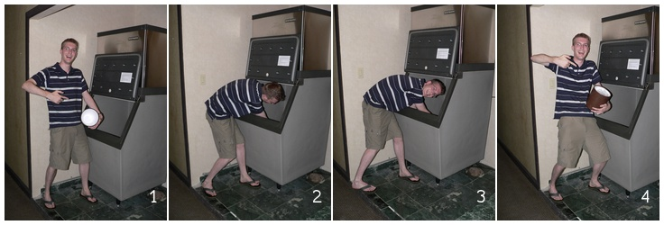

collage
=======

Take a bunch of images and generate an image sequence.

Why?
----

Maybe you have a number of photos from a sunset you want to show off as a
sequence. Or you drew a comic strip and want to combine the panels. Or you've
been taking a photo of a flower every day while it was blooming.

It's up to you, really!

Example
-------
Here's an example with a few photos I took a few years back:

    % ./collage.py -i /.../photos --settings=mysettings
    Found 4 input files. Creating a grid with 4 columns and 1 rows.
    Processing /.../photos/P1010599.jpg...
    Processing /.../photos/P1010600.jpg...
    Processing /.../photos/P1010601.jpg...
    Processing /.../photos/P1010602.jpg...
    Writing output file: /.../collage/output/collage.jpg

And the final file looks like this:

Configuration
-------------

The script is quite configurable. All current config options are in the file
``settings.py``. To change them, make a file ``settings_local.py`` and
overwrite whichever settings you want.

Note: ``settings_local`` does not automatically inherit settings. If you want
to reuse settings from settings.py, do ``from settings import *`` at the top
of your settings file.

Acknowledgments
---------------

* Without the PIL (Python Image Library), this script would do... nothing.
* Thanks to Brenda Gallo for making the font "Happy Monkey", and thanks to
  Google Web Fonts for helping me find it.

License
-------

This software is licensed under a BSD License. Please read the file LICENSE
for more information.
